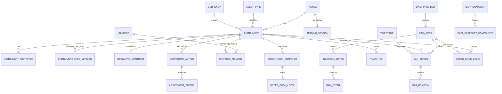
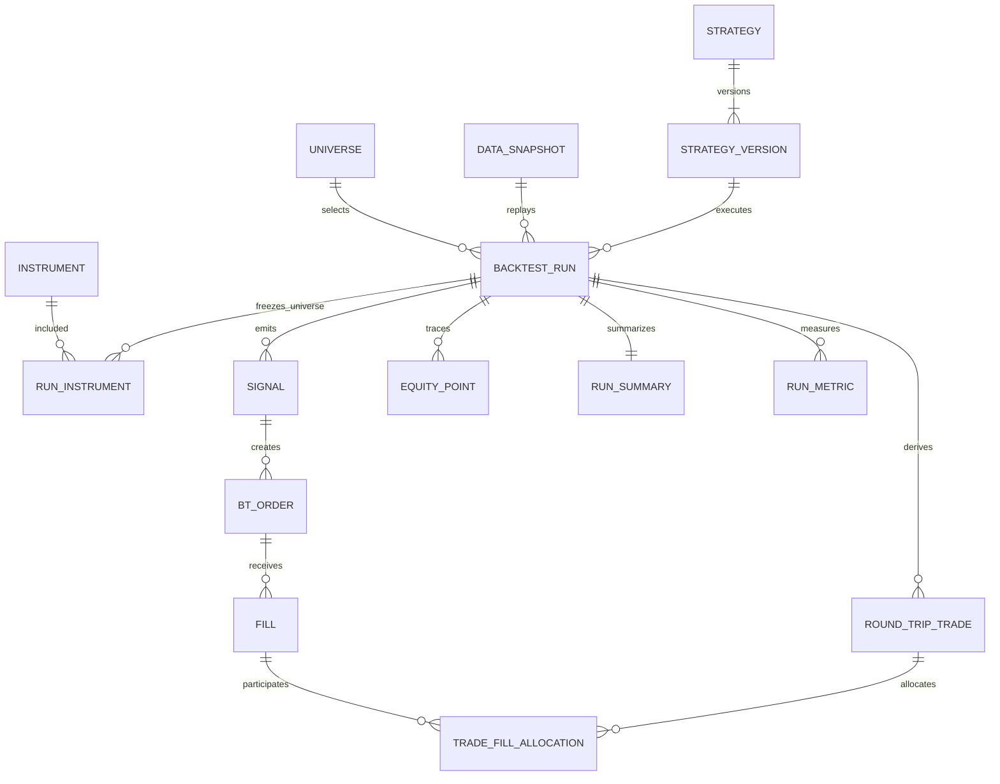
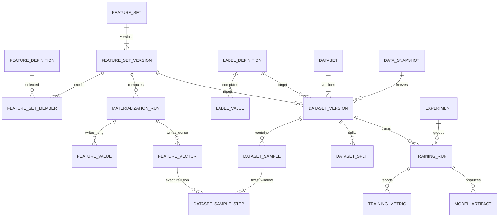

# طراحی پایگاه داده سامانه معاملات، بک‌تست و یادگیری ماشین

- نسخه سند: ۱.۰
- پروفایل اجرایی مرجع: PostgreSQL 16+
- قرارداد زمانی: UTC در پایگاه داده، منطقه زمانی بازار فقط در Metadata
DDL مرجع: `db/postgresql/migrations/0001_core_schema.sql`، `db/postgresql/migrations/0002_technical_backtest_completion.sql` و `db/postgresql/migrations/0003_point_in_time_hardening.sql`

> فاز اجرایی فعلی فقط تکمیل بک‌تست تکنیکال است. Schemaهای ML/DL موجود حفظ شده‌اند، اما تا فاز بعدی توسعه یا بهینه‌سازی نمی‌شوند.

---

## ۱. تحلیل نیازمندی‌ها و رویکرد طراحی

### ۱.۱ تصمیم معماری

پیشنهاد پایه یک معماری ترکیبی است:

1. **PostgreSQL رابطه‌ای (Relational OLTP/HTAP)** به‌عنوان System of Record برای Instrument Master، نسخه‌بندی داده، بک‌تست، Feature Metadata، Lineage و قیود مالی.
2. **جداول سری‌زمانی پارتیشن‌شده (Partitioned Time-Series Tables)** داخل PostgreSQL برای کندل، Tick، Order Book، Feature و Label.
3. **Object Storage با فرمت Parquet** برای Tick/Order-book سرد، Manifest مجموعه‌داده‌های بسیار بزرگ و خروجی آموزش.
4. **BigQuery یا Snowflake** به‌عنوان مسیر اختیاری Scale-out تحلیلی؛ مدل منطقی ثابت می‌ماند و فقط Physical DDL تغییر می‌کند.

یک Time-Series DB مستقل در نسخه اول لازم نیست. PostgreSQL تراکنش ACID، Foreign Key، Revision History، Point-in-Time Join و SQL تحلیلی را هم‌زمان فراهم می‌کند. در صورت اثبات گلوگاه، TimescaleDB می‌تواند به‌صورت افزونه جایگزین Declarative Partitioning جداول Fact شود، بدون تغییر مدل منطقی. برای میلیاردها Tick، نگهداری همه داده در Row Store اقتصادی نیست؛ Hot Tier در PostgreSQL و Cold Tier در Parquet انتخاب عملی‌تری است.

این تصمیم با اصول منابع محلی درباره کاهش افزونگی، جامعیت ارجاعی، نرمال‌سازی و انتخاب آگاهانه بین ACID و NoSQL هم‌راستا است. Denormalization فقط در دو مسیر داغ و با دلیل عملکردی انجام می‌شود: `ml.feature_vector.values` و Summaryهای بک‌تست.

### ۱.۲ یافته‌های اختصاصی از منابع موجود پروژه

منابع BrsApi موجود در `refrences/` چند الزام واقعی به طراحی اضافه می‌کنند:

- API کندل، داده روز جاری را با تایم‌فریم ۲ دقیقه و داده روزانه را در دو حالت تعدیل‌شده/تعدیل‌نشده عرضه می‌کند. بنابراین ۱ دقیقه از آن قابل بازسازی نیست و باید از Tape یا Feed دقیق‌تر ساخته شود.
- `pl` در داده تاریخی «آخرین قیمت» و `pc` «قیمت پایانی» است؛ نگاشت هر دو به `close` اشتباه است. Canonical Mapping باید برای هر Feed نسخه‌بندی شود.
- Tape دارای `row`, `time`, `price`, `volume`, `canceled` است. پس داده معامله نیازمند Sequence، Revision و Cancellation است، نه Upsert مخرب.
- External ID نماد ممکن است ۱۷ رقم یا بیشتر باشد و در JSON/JavaScript دقت خود را از دست بدهد؛ شناسه عرضه‌کننده به‌صورت `TEXT` و شناسه داخلی به‌صورت `BIGINT` نگهداری می‌شود.
- مقادیر منفی گاهی با علامت انتهایی مانند `784-` می‌آیند؛ Raw Payload باید بدون تغییر حفظ و Parser نسخه‌بندی شود.
- تاریخ‌ها عمدتاً جلالی و زمان‌ها بدون Zone هستند. مقدار خام حفظ می‌شود و مقدار Canonical با تقویم بازار و IANA Time Zone به `TIMESTAMPTZ` تبدیل می‌شود.
- Snapshot نماد، پنج سطح عرضه/تقاضا را به شکل ستون‌های `pd1..po5` می‌دهد. مدل Canonical آن را به `order_book_snapshot` و `order_book_level(side, level_no)` نرمال می‌کند.
- منابع مشتقه شامل Underlying، Strike، Expiry، Contract Size، Margin و Open Interest هستند؛ بنابراین Instrument یک Supertype و قرارداد مشتقه یک Subtype است.
- NAV صندوق، کدال، سهامداران، شاخص، ارز، کریپتو و کامودیتی نشان می‌دهد توسعه منابع بیرونی باید از ابتدا دارای `source`, `series`, `event_ts` و `available_at` باشد.

Snapshotهای HTML قرارداد زنده Provider را تضمین نمی‌کنند؛ Raw Zone و Contract Test باید تغییر Schema منبع را آشکار کنند. هیچ API Key موجود در فایل‌های مرجع نباید Credential تولیدی تلقی یا در Migration ثبت شود.

### ۱.۳ لایه‌های داده

```text
Provider / Exchange
       |
       v
ingest.raw_event  -- immutable, checksum, raw Jalali/text values
       |
       v
canonical validation + mapping version + quarantine
       |
       +--> catalog.*      instrument, calendar, corporate action, universe
       +--> market.*       bars, ticks, order book
       +--> external.*     fundamentals, news, sentiment, on-chain, NAV
       |
       v
catalog.data_snapshot  -- knowledge cutoff + component checksums
       |
       +--> backtest.*     reproducible signals/orders/fills/trades/metrics
       +--> ml.*           point-in-time features/labels/frozen datasets/models
```

### ۱.۴ قواعد تغییرناپذیر طراحی

1. **Raw append-only است.** اصلاح Provider رکورد قبلی را پاک نمی‌کند؛ Revision یا Cancel Event جدید می‌سازد.
2. **سه زمان از هم جدا هستند:**
   - `event_ts`: زمان رخداد در بازار؛
   - `available_at`: اولین زمان انتشار/قابل‌دانستن عمومی؛
   - `system_available_at` یا `ingested_at`: اولین زمان قابل‌استفاده در سامانه خودمان.
3. **Snapshot به معنی کپی کامل نیست.** انتخاب Revisionها با `available_at <= knowledge_cutoff_ts`، همراه با Hash و Watermark اجزا Freeze می‌شود.
4. **زمان انتهای بازه Exclusive است.** تمام APIها و Queryها از قرارداد `[from_ts, to_ts)` استفاده می‌کنند؛ این قرارداد هم‌پوشانی Batch و Partition را حذف می‌کند.
5. **Daily Bar با Session تعریف می‌شود، نه ۲۴ ساعت.** `trading_date`, `session_open_ts`, `session_close_ts` از تقویم بازار می‌آیند.
6. **Universe تاریخ‌مند است.** استفاده از اعضای امروز شاخص برای گذشته ممنوع است؛ `valid_from/valid_to` مانع Survivorship Bias می‌شود.
7. **Dataset یا Backtest بدون Data Snapshot نهایی معتبر نیست.** Strategy Code Hash، Parameter Hash، Seed، Engine Version و Cost Model نیز بخشی از Reproducibility هستند.
8. **Feature Set Freeze‌شده ویرایش نمی‌شود.** تغییر فرمول، Lookback، Lag، Adjustment یا ترتیب ستون نسخه جدید می‌سازد.
9. **Label از Feature جداست.** Future Outcome فقط در Target قرار می‌گیرد و Purge/Embargo بر اساس `outcome_end_ts` اعمال می‌شود.
10. **Money و Price با Float ذخیره نمی‌شوند.** Float فقط برای Metric و Tensor آموزش استفاده می‌شود.
11. **Snapshot شرط Point-in-Time را حذف نمی‌کند.** `knowledge_cutoff_ts` فقط سقف Revisionهای قابل انتخاب است؛ در هر لحظه تصمیم نیز باید Revision انتخابی در همان `decision_ts` قابل‌دسترسی بوده باشد.
12. **Availability یک Feature مشتق‌شده از تمام ورودی‌هاست.** زمان عمومی آن حداقل `GREATEST(window_end_ts, max_source_available_at, availability_rule_ts)` و زمان واقعی سامانه حداقل `GREATEST(feature_available_at, materialization_finished_at)` است.
13. **مصرف تاریخی Bar فقط از `market.bars_as_of` انجام می‌شود.** View `market.current_bar` cutoff ندارد و فقط برای Current-state عملیاتی است.

### ۱.۵ انتخاب نوع داده

| مفهوم | نوع PostgreSQL | دلیل |
|---|---|---|
| زمان رخداد/انتشار/دریافت | `TIMESTAMPTZ(6)` | Instant یکتا، ذخیره داخلی UTC و نمایش با Zone نشست |
| تاریخ معاملاتی | `DATE` | کلید تقویم و Session؛ مستقل از ساعت |
| زمان Nanosecond Feed | `TIMESTAMPTZ(6)` + `event_ts_ns BIGINT`/Sequence | PostgreSQL دقت میکروثانیه دارد؛ ستون دوم ترتیب دقیق را حفظ می‌کند |
| قیمت، مقدار، Fee، PnL | `NUMERIC(38,18)` | محاسبه دقیق و پوشش سهام، FX و Crypto؛ بدون خطای IEEE-754 |
| تعداد رکورد/Sequence | `BIGINT` | ظرفیت بالا و سازگاری با Feedهای حجیم |
| شناسه داخلی | `BIGINT GENERATED ... AS IDENTITY` | Index کوچک‌تر از UUID و Join سریع‌تر |
| شناسه Provider/ISIN | `TEXT`/`VARCHAR` | حفظ صفر ابتدایی و جلوگیری از افت دقت JSON |
| Ratio و Metric مدل | `DOUBLE PRECISION` | سرعت محاسبات آماری؛ Exact Money نیست |
| Feature Tensor | `DOUBLE PRECISION[]` | واکشی یک Row به‌ازای Entity/Time؛ ترتیب با Ordinal نسخه Feature Set |
| تنظیمات و Metadata کم‌تکرار | `JSONB` | انعطاف و Audit؛ فیلدهای Hot باید ستون Typed باشند |
| Hash | `CHAR(64)` | SHA-256 قابل‌انتقال و قابل مقایسه |

از PostgreSQL `MONEY`، Enumهای موتور، Timestamp بدون Zone و JSONB برای OHLCV یا Featureهای پرتکرار استفاده نمی‌شود. قیمت منفی به‌صورت کلی ممنوع نشده است؛ بعضی ابزارها/قراردادها می‌توانند قیمت منفی داشته باشند. Validation دامنه باید به Instrument Spec وابسته باشد.

---

## ۲. نمودار ERD

برای خوانایی، ERD در سه Context نمایش داده شده است. ستون‌های کامل و قیود در DDL و Data Dictionary بخش ۳ قرار دارند.

### ۲.۱ مرجع ابزار و داده بازار



### ۲.۲ بک‌تست و Execution Ledger



سیگنال، سفارش، Fill و Round-trip Trade عمداً یکی نشده‌اند. یک سیگنال می‌تواند چند سفارش، یک سفارش چند Partial Fill و یک معامله رفت‌وبرگشتی چند Fill ورودی/خروجی داشته باشد. این تفکیک برای Commission، Slippage، Rejection و Market Impact ضروری است.

برای تطبیق مالی (Financial Reconciliation)، Fill تنها منبع حقیقت Execution است و باید به Cash/Position Ledger مشتق شود. Commission، Tax، Slippage، Borrow Fee، Funding، Margin Interest، Dividend و Corporate Action همگی Entry مستقل دارند. Equity Curve از جمع Cash چندارزی و Position Valuation با FX Rate قابل‌دانستن در همان زمان ساخته می‌شود؛ نباید صرفاً جمع `trade.net_pnl` باشد.

### ۲.۳ Feature Store، Dataset و Model Registry



---

## ۳. تعریف Schema و Data Dictionary

DDL اجرایی و Commentهای ستونی در `db/postgresql/migrations/0001_core_schema.sql` مرجع نهایی هستند. شش Schema استفاده می‌شود:

فرهنگ کامل ستون‌ها، نوع، Nullable بودن و معنای هر جدول در `docs/schema_dictionary_fa.md` قرار دارد؛ این بخش خلاصه مسئولیت و روابط را ارائه می‌کند.

| Schema | مسئولیت | سیاست نوشتن |
|---|---|---|
| `catalog` | Provider، Feed، Instrument، Calendar، Universe، Corporate Action، Snapshot | Master data نسخه‌دار |
| `ingest` | Batch، Raw Payload و Audit دریافت | Append-only |
| `market` | Bar، Tick و Order Book Canonical | Append-only Revision/Cancel |
| `external` | Fundamental، News، Sentiment، On-chain و سری‌های بیرونی | Append-only Point-in-Time |
| `backtest` | Strategy، Run، Execution Ledger و Performance | Immutable پس از Finalization |
| `ml` | Feature/Label، Dataset، Experiment و Artifact | Versioned؛ نسخه Frozen غیرقابل‌ویرایش |

### ۳.۱ قرارداد کلید، NULL و حذف

- تمام FKها به Master Data با `ON DELETE RESTRICT/NO ACTION` هستند؛ حذف Instrument یا Snapshot تاریخی مجاز نیست.
- حذف Cascade فقط برای Childهایی قابل‌قبول است که مالکیت کامل آن‌ها با Parent Draft باشد؛ Run و Dataset نهایی Soft-delete/Archive می‌شوند.
- ستون Nullable یعنی «واقعاً نامعلوم/ناموجود»، نه مقدار صفر. `volume = 0` با `volume IS NULL` معنای متفاوت دارد.
- Natural Key منبع در کنار Surrogate Key حفظ می‌شود. Idempotency بر Natural Key + Revision/Availability برقرار است.
- روی Fact پارتیشن‌شده، Primary/Unique Key حتماً Partition Key را شامل می‌شود؛ این محدودیت PostgreSQL برای تضمین یکتایی بین Partitionهاست.

### ۳.۲ جدول‌های Catalog

- Master data: `currency`, `asset_type`, `data_provider`, `data_feed`, `venue`, `timeframe`, `trading_session`, `instrument`.
- تاریخچه و subtype: `instrument_identifier`, `instrument_spec_version`, `derivative_contract`.
- تعدیلات: `corporate_action`, `adjustment_set`, `adjustment_factor`.
- Bias/Reproducibility: `universe`, `universe_member`, `data_snapshot`, `data_snapshot_component`.

Migration `0003` بازه‌های نیمه‌باز `[from,to)` را برای سه کلید منطقی زیر در سطح دیتابیس غیرهم‌پوشان می‌کند:

- `(provider_id, identifier_type, identifier_value)` در `catalog.instrument_identifier`؛
- `instrument_id` در `catalog.instrument_spec_version`؛
- `(universe_id, instrument_id)` در `catalog.universe_member`.

`NULL` در انتهای بازه مثبت بی‌نهایت است و بازه‌های مجاور مجازند. Trigger هر جدول ابتدا `pg_advisory_xact_lock` مشتق از نام جدول و همان کلید منطقی را می‌گیرد و سپس هم‌پوشانی را بررسی می‌کند؛ بنابراین دو Writer رقیب برای یک Entity هم‌زمان Commit نمی‌شوند، ولی کلیدهای مستقل قفل سراسری ندارند. خطای هم‌پوشانی `23P01` است و پیام، جدول، کلید و بازه پیشنهادی را مشخص می‌کند.

### ۳.۳ جدول‌های Ingestion و Market

- Audit: `ingestion_batch`, `raw_event`.
- قیمت: `bar_series`, `bar_revision` و View کمکی `current_bar`.
- Microstructure: `trade_tick`, `order_book_snapshot`, `order_book_level`, `order_book_delta`.
- داده بیرونی: `external.data_series`, `external.observation`, `external.document`.

### ۳.۴ جدول‌های Backtest

- تعریف: `strategy`, `strategy_version`, `run`, `run_instrument`.
- اجرا: `signal`, `bt_order`, `fill`, `round_trip_trade`, `trade_fill_allocation`.
- حسابداری: `cash_ledger`, `position_snapshot`, `equity_point`.
- خروجی: `run_summary`, `run_metric`.

### ۳.۵ جدول‌های Feature Store و ML

- Feature: `feature_definition`, `feature_set`, `feature_set_version`, `feature_set_member`, `feature_materialization_run`, `feature_value`, `feature_vector`.
- Label: `label_definition`, `label_materialization_run`, `label_value`.
- Dataset: `dataset`, `dataset_version`, `dataset_sample`, `dataset_sample_step`, `dataset_split`, `dataset_sample_assignment`.
- Experiment: `experiment`, `training_run`, `training_metric`, `model_artifact`.

---

## ۴. پارتیشن‌بندی، ایندکس‌گذاری و بهینه‌سازی

### ۴.۱ طرح پارتیشن

| جدول Fact | Range سطح اول | Hash سطح دوم | Granularity اولیه | Retention Hot پیشنهادی |
|---|---|---|---|---|
| Bar Revision | `bar_open_ts` | `bar_series_id` فقط در Leaf بزرگ | ماهانه؛ Daily-only می‌تواند سالانه باشد | بلندمدت |
| Trade Tick | `event_ts` | `instrument_id` با ۸/۱۶ Bucket در حجم بالا | روزانه | ۳۰ تا ۹۰ روز |
| Order Book | `event_ts` | `instrument_id` اختیاری | روزانه | Delta: ۷ تا ۳۰ روز؛ Snapshot بیشتر |
| Raw Event | `ingested_at` | ندارد یا Feed Hash | ماهانه/روزانه برحسب نرخ | طبق الزام Audit |
| Feature Value/Vector | `event_ts` | `instrument_id` فقط در حجم بالا | ماهانه | تا Freeze/Archive Dataset |
| Label Value | `anchor_ts` | معمولاً ندارد | ماهانه | بلندمدت |
| Backtest Output | بدون Partition در شروع | بعداً `HASH(run_id)` | بر اساس Benchmark | بلندمدت |

پارتیشن مستقل `LIST` برای هر نماد ساخته نمی‌شود؛ هزاران نماد باعث Partition Explosion و افزایش Planning Time می‌شوند. الگوی درست `RANGE(time) -> HASH(instrument_id)` است. Hash فقط زمانی فعال می‌شود که اندازه یا Contention هر Leaf آن را توجیه کند. برای Bars ده‌ساله، ۱۲۰ ماه × ۸ Bucket برابر ۹۶۰ Leaf است؛ برای Tick با ۹۰ روز Hot، ۹۰ × ۸ برابر ۷۲۰ Leaf.

Partitionهای آینده باید پیشاپیش ساخته شوند. نبود Partition باید Ingestion را Fail کند تا Timestamp خراب پنهان نشود؛ `DEFAULT PARTITION` در مسیر اصلی توصیه نمی‌شود. Backfill حجیم ابتدا در جدول Standalone با `CHECK` دقیق Range بارگیری و سپس Attach می‌شود.

### ۴.۲ ایندکس‌های دقیق

| جدول/مسیر | نوع و ترتیب کلید | دلیل |
|---|---|---|
| Instrument Alias | B-tree Unique `(provider_id, external_id, valid_from)` | Resolution شناسه منبع و تاریخچه تغییر |
| Instrument Symbol | B-tree `(venue_id, canonical_symbol)` | جست‌وجوی UI/Resolver |
| Universe Member | B-tree `(universe_id, valid_from, valid_to, instrument_id)` | Membership as-of و حذف Survivorship Bias |
| Bar Revision | B-tree `(bar_series_id, bar_open_ts, available_at DESC, revision_no DESC)` | Range یک Series و انتخاب آخرین Revision مجاز |
| Bar Revision | BRIN `(bar_open_ts)` روی Leaf بزرگ | Scan وسیع زمانی با Index بسیار کوچک |
| Trade Tick | B-tree `(instrument_id, event_ts, source_sequence, revision_no)` | Replay مرتب یک نماد |
| Trade Tick | BRIN `(event_ts)` | Scan بین‌نمادی/زمانی و Archive |
| Order Book Snapshot | B-tree `(instrument_id, event_ts DESC, source_sequence DESC)` | نزدیک‌ترین Snapshot قبل از T |
| Order Book Level | PK مرکب Snapshot + `side, level_no` | Reconstruction بدون JSON Parsing |
| External Observation | B-tree `(series_id, entity_id, event_ts, available_at DESC)` | Point-in-Time Join |
| Backtest Run | B-tree `(strategy_version_id, started_at DESC)` | مقایسه اجراهای Strategy |
| Signal/Order/Fill | B-tree `(run_id, instrument_id, event_ts)` | Replay و گزارش Run |
| Round-trip Trade | B-tree `(run_id, instrument_id, entry_ts)` | گزارش معامله و PnL |
| Feature Value | B-tree `(feature_definition_id, instrument_id, event_ts, available_at DESC, revision_no DESC)` | PIT Lookup Feature منفرد |
| Feature Vector | B-tree `(feature_set_version_id, instrument_id, event_ts, available_at DESC, revision_no DESC)` | Sliding Window |
| Feature/Label Fact | BRIN روی Event/Anchor Time | Scan Range گسترده |
| Dataset Sample | B-tree `(dataset_version_id, instrument_id, anchor_ts)` | Batch Reader و Fold |
| Training Metric | B-tree `(training_run_id, split_role, metric_name)` | Dashboard آزمایش |
| Metadata JSONB | GIN فقط برای Query اثبات‌شده | جلوگیری از Write Amplification بی‌دلیل |

قاعده ترتیب B-tree: ستون‌های Equality در چپ، سپس ستون Range/Sort. `INCLUDE` کردن OHLCV یا Feature Array به‌صورت پیش‌فرض ممنوع است، چون Index را بزرگ می‌کند. فقط روی Partition بسته و پس از `EXPLAIN (ANALYZE, BUFFERS)` قابل توجیه است. BRIN جای B-tree نماد/زمان را نمی‌گیرد؛ فقط وقتی مفید است که زمان با ترتیب فیزیکی Rowها هم‌بستگی داشته باشد.

### ۴.۳ تنظیم فیزیکی و Ingestion

1. Raw را با Batch و Checksum دریافت کنید؛ Payload اولیه را تغییر ندهید.
2. برای Bulk Load از Staging و `COPY` استفاده کنید، نه Insert سطری.
3. Validation شامل Schema Drift، تبدیل جلالی، Time Zone، OHLC، Unit/Currency، Duplicate، Sequence Gap و Cancellation باشد.
4. در یک Transaction، Canonical Rows و Watermark Batch را Commit کنید.
5. پس از بستن Lateness Window، `ANALYZE` و BRIN Summarize اجرا شود.
6. Partition بسته با `VACUUM (ANALYZE, FREEZE)` آماده Archive/Read-mostly شود.
7. Archive: `DETACH PARTITION`، Export مرتب به Parquet، ثبت URI/Hash/Row Count، تست بازیابی و سپس Drop کنترل‌شده؛ نه `DELETE` میلیاردها ردیف.

برای Tick بسیار حجیم، Benchmark جایگزین `NUMERIC(38,18)` با `price_ticks BIGINT` و `quantity_lots BIGINT` را بررسی کند. Scale و Tick Size باید در `instrument_spec_version` نسخه‌بندی شود؛ این Optimization بدون Metadata صحیح خطرناک است.

---

## ۵. نمونه Queryهای کلیدی

پارامترهای `:name` باید با Bind Parameter در Driver جایگزین شوند، نه String Interpolation.

### ۵.۱ واکشی کندل یک نماد برای بک‌تست با `market.bars_as_of`

Migration `0003` Query انتخاب Revision را در یک Interface ممیزی‌شده متمرکز می‌کند. چون Schema نوع Enum/Domain مشترکی برای Replay ندارد، پارامتر آخر `VARCHAR` است و فقط دو مقدار دقیق `PUBLIC_REPLAY` و `ACTUAL_SYSTEM_REPLAY` را می‌پذیرد:

```sql
market.bars_as_of(
    p_bar_series_id BIGINT,
    p_from_ts TIMESTAMPTZ,
    p_to_ts TIMESTAMPTZ,
    p_knowledge_cutoff_ts TIMESTAMPTZ,
    p_replay_mode VARCHAR
)
```

نمونه Canonical برای resolve نماد و واکشی یک بازه:

```sql
WITH selected_series AS (
    SELECT bs.bar_series_id
    FROM market.bar_series AS bs
    JOIN catalog.instrument AS i
      ON i.instrument_id = bs.instrument_id
    JOIN catalog.venue AS v
      ON v.venue_id = i.venue_id
    JOIN catalog.timeframe AS tf
      ON tf.timeframe_id = bs.timeframe_id
    JOIN catalog.data_feed AS f
      ON f.feed_id = bs.feed_id
    JOIN catalog.data_provider AS p
      ON p.provider_id = f.provider_id
    WHERE v.venue_code = :venue_code
      AND i.canonical_symbol = :symbol
      AND tf.timeframe_code = :timeframe
      AND p.provider_code = :provider_code
      AND f.feed_code = :feed_code
      AND bs.price_basis = :price_basis
)
SELECT
    b.bar_open_ts,
    b.bar_close_ts,
    b.open_price,
    b.high_price,
    b.low_price,
    b.close_price,
    b.volume,
    b.revision_no,
    b.effective_available_at
FROM selected_series AS ss
CROSS JOIN LATERAL market.bars_as_of(
    ss.bar_series_id,
    :from_ts,
    :to_ts,
    LEAST(:decision_ts, :snapshot_knowledge_cutoff_ts),
    :replay_mode
) AS b
ORDER BY b.bar_open_ts;
```

برای Replay عمومی و Replay واقعی سامانه، فراخوانی مستقیم به‌ترتیب چنین است:

```sql
SELECT *
FROM market.bars_as_of(
    :bar_series_id, :from_ts, :to_ts, :cutoff_ts, 'PUBLIC_REPLAY'
);

SELECT *
FROM market.bars_as_of(
    :bar_series_id, :from_ts, :to_ts, :cutoff_ts, 'ACTUAL_SYSTEM_REPLAY'
);
```

تابع فقط `is_final = TRUE` و `bar_close_ts <= cutoff` را می‌پذیرد، بازه رویداد را `[from_ts,to_ts)` اعمال می‌کند و در هر Bar آخرین Revision واجد شرایط را بر اساس Availability متناظر و سپس `revision_no DESC` انتخاب می‌کند. بنابراین Correction دیرهنگام فقط پس از cutoff خودش دیده می‌شود و دو Mode در فاصله `available_at < cutoff < system_available_at` پاسخ متفاوت دارند.

برای Replay ترتیبی باید این تابع در هر مرز تصمیم با `cutoff = LEAST(decision_ts, snapshot.knowledge_cutoff_ts)` فراخوانی شود و `to_ts <= cutoff` باشد. استفاده از یک cutoff انتهای Run برای همه تصمیم‌های قبلی، Correctionهایی را که آن زمان قابل‌دانستن نبودند وارد می‌کند. `market.current_bar` هیچ cutoff و الزام Final ندارد و برای Backtest تاریخی، Feature PIT یا Dataset تاریخی ML ممنوع است؛ جست‌وجوی Repository مصرف‌کننده اجرایی تاریخی برای آن پیدا نکرد.

### ۵.۲ استخراج Window دقیق ۲۰ کندلی + Feature + Label برای LSTM

این Query از Manifest رابطه‌ای Freeze‌شده می‌خواند؛ بنابراین Missing Bar یا Revision دیرهنگام، ۲۰ گام را پس از ساخت Dataset تغییر نمی‌دهد.

```sql
SELECT
    s.dataset_version_id,
    s.sample_id,
    s.instrument_id,
    s.prediction_ts,
    sp.fold_no,
    sp.split_role,
    jsonb_agg(
        jsonb_build_object(
            'step', st.step_no,
            'bar_open_ts', b.bar_open_ts,
            'ohlcv', jsonb_build_array(
                b.open_price::DOUBLE PRECISION,
                b.high_price::DOUBLE PRECISION,
                b.low_price::DOUBLE PRECISION,
                b.close_price::DOUBLE PRECISION,
                b.volume::DOUBLE PRECISION
            ),
            'features', to_jsonb(fv.values)
        ) ORDER BY st.step_no
    ) AS x_20_by_features,
    COALESCE(
        to_jsonb(lv.value_float),
        to_jsonb(lv.value_integer),
        to_jsonb(lv.value_text),
        lv.value_json
    ) AS y
FROM ml.dataset_sample AS s
JOIN ml.dataset_version AS dv
  ON dv.dataset_version_id = s.dataset_version_id
JOIN ml.dataset_sample_step AS st
  ON st.dataset_version_id = s.dataset_version_id
 AND st.sample_id = s.sample_id
JOIN market.bar_revision AS b
  ON b.bar_open_ts = st.bar_open_ts
 AND b.bar_series_id = st.bar_series_id
 AND b.revision_no = st.bar_revision_no
 AND b.available_at = st.bar_available_at
JOIN ml.feature_vector AS fv
  ON fv.event_ts = st.feature_event_ts
 AND fv.feature_set_version_id = st.feature_set_version_id
 AND fv.instrument_id = st.instrument_id
 AND fv.timeframe_id = st.timeframe_id
 AND fv.available_at = st.feature_available_at
 AND fv.revision_no = st.feature_revision_no
JOIN ml.label_value AS lv
  ON lv.anchor_ts = s.label_anchor_ts
 AND lv.label_definition_id = s.label_definition_id
 AND lv.instrument_id = s.instrument_id
 AND lv.timeframe_id = s.timeframe_id
 AND lv.available_at = s.label_available_at
 AND lv.revision_no = s.label_revision_no
JOIN ml.dataset_sample_assignment AS a
  ON a.dataset_version_id = s.dataset_version_id
 AND a.sample_id = s.sample_id
JOIN ml.dataset_split AS sp
  ON sp.dataset_version_id = a.dataset_version_id
 AND sp.split_id = a.split_id
WHERE s.dataset_version_id = :dataset_version_id
  AND s.sample_id = :sample_id
  AND sp.fold_no = :fold_no
  AND sp.split_role = :split_role
  AND s.expected_steps = 20
  AND CASE WHEN dv.availability_mode = 'PUBLIC_REPLAY'
           THEN fv.available_at ELSE fv.system_available_at END <= s.prediction_ts
  AND CASE WHEN dv.availability_mode = 'PUBLIC_REPLAY'
           THEN b.available_at ELSE b.system_available_at END <= s.prediction_ts
  -- Label در prediction_ts مجهول است؛ فقط باید تا Freeze Dataset حاصل شده باشد.
  AND CASE WHEN dv.availability_mode = 'PUBLIC_REPLAY'
           THEN lv.available_at ELSE lv.system_available_at END <= dv.knowledge_cutoff_ts
GROUP BY
    s.dataset_version_id, s.sample_id, s.instrument_id, s.prediction_ts,
    sp.fold_no, sp.split_role,
    lv.value_float, lv.value_integer, lv.value_text, lv.value_json,
    s.expected_steps
HAVING COUNT(*) = 20
   AND MIN(st.step_no) = 0
   AND MAX(st.step_no) = 19
   AND BOOL_AND(fv.missing_count = 0);
```

### ۵.۳ گزارش معیارهای تمام Runهای یک Strategy

```sql
SELECT
    s.strategy_code,
    s.display_name AS strategy_name,
    sv.version_no AS strategy_version,
    r.run_id,
    r.run_code,
    r.parameters,
    r.data_snapshot_id,
    r.event_from,
    r.event_to,
    rs.total_return,
    rs.annualized_return,
    rs.sharpe_ratio,
    rs.sortino_ratio,
    rs.max_drawdown,
    rs.win_rate,
    rs.profit_factor,
    rs.trade_count,
    rs.net_pnl_base,
    rs.total_cost_base,
    rs.calculation_version,
    rs.annualization_basis,
    custom.metrics AS custom_metrics
FROM backtest.strategy AS s
JOIN backtest.strategy_version AS sv
  ON sv.strategy_id = s.strategy_id
JOIN backtest.run AS r
  ON r.strategy_version_id = sv.strategy_version_id
LEFT JOIN backtest.run_summary AS rs
  ON rs.run_id = r.run_id
LEFT JOIN LATERAL (
    SELECT jsonb_object_agg(
               rm.metric_name || ':' || rm.scope_key,
               rm.metric_value
           ) AS metrics
    FROM backtest.run_metric AS rm
    WHERE rm.run_id = r.run_id
) AS custom ON TRUE
WHERE s.strategy_code = :strategy_code
  AND r.status = 'SUCCEEDED'
  AND (:version_no IS NULL OR sv.version_no = :version_no)
ORDER BY rs.sharpe_ratio DESC NULLS LAST, rs.total_return DESC NULLS LAST;
```

### ۵.۴ Query ممیزی Leakage پیش از Freeze

خروجی باید صفر باشد:

```sql
SELECT COUNT(*) AS leakage_violation_count
FROM ml.dataset_sample AS s
JOIN ml.dataset_version AS dv USING (dataset_version_id)
JOIN ml.dataset_sample_step AS st
  ON st.dataset_version_id = s.dataset_version_id
 AND st.sample_id = s.sample_id
JOIN ml.feature_vector AS fv
  ON fv.event_ts = st.feature_event_ts
 AND fv.feature_set_version_id = st.feature_set_version_id
 AND fv.instrument_id = st.instrument_id
 AND fv.timeframe_id = st.timeframe_id
 AND fv.available_at = st.feature_available_at
 AND fv.revision_no = st.feature_revision_no
WHERE dv.dataset_version_id = :dataset_version_id
  AND CASE WHEN dv.availability_mode = 'PUBLIC_REPLAY'
           THEN fv.available_at ELSE fv.system_available_at END > s.prediction_ts;
```

---

## ۶. راهنمای توسعه‌دهندگان و دانشمندان داده

### ۶.۱ اتصال و Transaction

- برنامه API از Connection Pool مانند PgBouncer در حالت Transaction یا Pool داخلی Driver استفاده کند. نقطه شروع: `pool_size ≈ 2 × CPU تا 4 × CPU` برای کل سرویس‌ها، سپس با Queue Time و DB Saturation تنظیم شود؛ صدها Connection مستقیم نسازید.
- Workerهای Bulk/ML Pool جدا و محدود داشته باشند تا API گرسنه نشود.
- Session را با `SET TIME ZONE 'UTC'`, `application_name`, `statement_timeout`, `lock_timeout` و `idle_in_transaction_session_timeout` مقداردهی کنید.
- Readهای معمول `READ COMMITTED`؛ ساخت Snapshot/Freeze در Transaction کوتاه و کنترل‌شده `REPEATABLE READ` یا با Watermark صریح انجام شود.
- `INSERT/UPDATE` روی `instrument_identifier`, `instrument_spec_version` و `universe_member` فقط در `READ COMMITTED` مجاز است؛ Guard در Isolation دیگر `0A000` می‌دهد، چون Snapshot ثابت پس از انتظار Advisory Lock ممکن است Commit رقیب را نبیند. این محدودیت به Transactionهای فقط‌خواندنی Snapshot مربوط نیست.
- Retry فقط برای خطاهای Transient مانند Serialization/Deadlock و با Idempotency Key انجام شود.
- Migration با Advisory Lock و Checksum اجرا شود؛ `IF NOT EXISTS` جای Versioned Migration را نمی‌گیرد.
- Collision بسیار نادر Hash قفل ممکن است دو کلید مستقل را محافظه‌کارانه سریال کند، ولی هم‌پوشانی کاذب نمی‌سازد. تغییر گروهی چند بازه باید با ترتیب ثابت کلید/زمان انجام شود و Deadlock عادی `40P01` قابل Retry باشد.

### ۶.۲ خواندن Batch و Training

- بازه‌ها را همیشه با `instrument/series + from_ts + to_ts` محدود کنید تا Partition Pruning فعال شود.
- Pagination زمانی/Keyset استفاده کنید؛ `OFFSET` بزرگ ممنوع است.
- Driver باید Server-side Cursor، Arrow/Polars/Pandas Chunk یا `COPY TO STDOUT` را برای Batchهای بزرگ به کار گیرد.
- Dataset بزرگ را یک‌باره به RAM نکشید؛ Partition/Instrument/Date Shardها را Streaming کنید.
- برای GPU، Windowها را قبلاً به Parquet/Arrow با Row Group مناسب Export کنید؛ PostgreSQL محل Shuffle هر Epoch نیست.
- Query و Planهای حیاتی با `EXPLAIN (ANALYZE, BUFFERS)` و داده هم‌اندازه Production Benchmark شوند.

### ۶.۳ قواعد اجباری Feature Engineering

- شرط Feature در زمان تصمیم: `event_ts <= prediction_ts AND eligible_at <= prediction_ts`.
- در بازسازی عمومی، `eligible_at = GREATEST(window_end_ts, max_source_available_at, availability_rule_ts)`؛ در بازسازی واقعی سامانه، `eligible_at = GREATEST(feature_available_at, system_available_at/materialization_finished_at)` است.
- `knowledge_cutoff_ts` Dataset/Snapshot فقط سقف داده‌های قابل انتخاب هنگام ساخت است و جای شرط `eligible_at <= prediction_ts` را برای هر Sample نمی‌گیرد.
- Fundamental با `period_end` Join نمی‌شود؛ با زمان انتشار Filing/Codal قابل استفاده است.
- Back-adjusted Price می‌تواند Corporate Action آینده را وارد گذشته کند؛ Adjustment Policy و Knowledge Cutoff باید صریح و نسخه‌دار باشد.
- `market.bars_as_of` برای Series تعدیل‌شده‌ای که `adjustment_set.knowledge_cutoff_ts` آن پس از cutoff Query است، `22023` می‌دهد تا Corporate Action آینده وارد گذشته نشود.
- فقط Bar نهایی (`is_final`) ورودی Feature است. Bar ناقص، Halt و Missing Session باید Flag شوند.
- Forward-fill فقط با محدودیت Domain و از گذشته به آینده؛ Backward-fill ممنوع است.
- StandardScaler، Imputer، PCA، Encoder و Feature Selection فقط روی Train Fold Fit و Artifact آن‌ها Hash شود.
- Random Row Split برای سری‌زمانی ممنوع است؛ Walk-forward/Purged Split با Embargo استفاده شود.
- Window Label نباید Split را قطع کند. اگر Label ده Bar آینده را می‌بیند، Train Sampleهایی که `outcome_end_ts` آن‌ها وارد Validation است Purge شوند.
- Dataset Frozen باید Revision دقیق هر Feature Step یا Manifest Parquet دارای آن Revisionها را نگه دارد؛ دوباره از Live `latest` نخواند.
- Dataset Frozen باید Revision دقیق Label، Split/Fold Assignment، Sample Weight و Universe Membership را نیز Freeze کند.
- Materialization Run و Label Run باید به Data Snapshot، Code SHA-256، Parameter Hash و Availability Mode متصل باشند.

### ۶.۴ کنترل‌های Data Quality

حداقل Gateهای قبل از Finalize Snapshot/Dataset:

1. یکتایی Natural Key و پیوستگی Sequence در هر Feed؛
2. `high >= low` و در Bar استاندارد، Open/Close داخل Range، مگر Mapping مستند خلاف آن را بگوید؛
3. Non-negative Quantity/Volume و Domain وابسته به Instrument؛
4. تطابق Currency/Unit و تبدیل «ریال/تومان/هزار ریال»؛
5. نبود Timestamp خارج Session مگر Feed شبانه‌روزی؛
6. Count، Min/Max Time و Checksum Source در برابر Canonical Batch؛
7. Feature Count برابر تعداد Memberهای Feature Set و Array Cardinality؛
8. هیچ Feature انتخاب‌شده‌ای بعد از Prediction Time قابل‌دسترسی نباشد؛
9. تعداد Stepهای Sample دقیقاً Sequence Length؛
10. Train/Validation/Test پس از Purge و Embargo Outcome Overlap نداشته باشند؛
11. Universe Membership و Instrument Spec به‌صورت as-of resolve شوند؛
12. Snapshot Hash، Manifest Hash، Code Hash و Parameter Hash ثبت شده باشند.

### ۶.۵ امنیت و عملیات

- Roleها جدا: `ingest_writer`, `canonical_writer`, `backtest_runner`, `ml_reader`, `readonly_analyst`, `migration_owner`.
- API Key و Secret فقط در Secret Manager/Environment امن؛ هرگز در Raw Documentation، SQL یا Git Commit قرار نگیرد.
- TLS، Backup رمزگذاری‌شده، PITR/WAL Archive و تست Restore دوره‌ای الزامی است.
- Raw Payload ممکن است متن خبر یا فایل دارای حق نشر باشد؛ Retention و Access Policy منبع رعایت شود.
- Run/Dataset نهایی Write-protected شود؛ اصلاح نتیجه با Run جدید انجام شود.
- Partition Manager، Failed Batch، Lag، Dead Tuple، Index Bloat، Long Transaction و Replica Lag مانیتور شوند.

---

## ۷. مقیاس‌پذیری و قابلیت انتقال

«یک DDL مشترک برای همه موتورها» هدف مناسبی نیست؛ **مدل منطقی، قرارداد زمان و Hash مشترک** و Physical Profile جدا نگهداری می‌شود.

| معنا | PostgreSQL | MySQL 8.4 | BigQuery | Snowflake |
|---|---|---|---|---|
| زمان UTC | `TIMESTAMPTZ(6)` | `DATETIME(6)` با قرارداد UTC | `TIMESTAMP` | `TIMESTAMP_TZ(6)` یا NTZ با قرارداد UTC |
| قیمت دقیق | `NUMERIC(38,18)` | `DECIMAL(38,18)` | `BIGNUMERIC(38,18)` | `NUMBER(38,18)` |
| Feature | `DOUBLE PRECISION` | `DOUBLE` | `FLOAT64` | `DOUBLE` |
| Metadata | `JSONB` | `JSON` | `JSON` | `VARIANT` |
| زمان‌بندی داده | Range Partition | Range Partition با محدودیت | `PARTITION BY DATE(ts)` | Micro-partition خودکار |
| بُعد نماد | Hash Subpartition + B-tree | Key/Subpartition | `CLUSTER BY instrument_id,...` | Cluster Key اختیاری |
| PK/FK | Enforced | Enforced؛ نه روی Fact partitioned InnoDB | `NOT ENFORCED` | Standard table عموماً Informational |

نکته مهم MySQL: InnoDB با User Partitioning از Foreign Key پشتیبانی نمی‌کند. بنابراین Profile MySQL باید یا Partition را برای Factهای دارای FK حذف کند، یا جامعیت Fact را با Pipeline/Data Quality Job اعمال کند. در BigQuery، Date Partition + Clustering روی `instrument_id, timeframe_id/feature_set_version_id` معادل طبیعی است. در Snowflake ابتدا از Micro-partition و Pruning استفاده و Cluster Key فقط برای جدول چندترابایتی با Scan ضعیف فعال شود.

برای افزونه‌های آینده:

- **News/Disclosure:** `external.document` با `published_at`, `available_at`, URI/Hash و Entity Link؛ متن حجیم در Object Storage.
- **Sentiment:** Series/Observation نسخه‌دار، همراه Model Version و Earliest Availability.
- **Fundamental/Codal:** Period End، Publish Time، Revision/Vintage و واحد مالی جدا.
- **On-chain:** Block Time، Observed Time، Confirmation Height/Count و Reorg Revision.
- **Alternative Data:** Schema ثابت Metadata + Observation Typed/JSON برای Long Tail؛ Featureهای پرتکرار Materialize می‌شوند.
- **Order Book کامل:** Snapshot دوره‌ای + Delta Sequence؛ بازسازی از نزدیک‌ترین Snapshot و Deltaهای بدون Gap.

---

## ۸. ترتیب پیاده‌سازی پیشنهادی

1. اجرای Migration و Seed کردن Currency، Asset Type، Venue، Timeframe و Provider؛
2. ساخت Instrument Resolver، Calendar و Mapping Versionهای منابع؛
3. راه‌اندازی Raw Ingestion، Quarantine، Checksum و Contract Tests؛
4. ایجاد Partitionهای آینده و Canonicalizer Bar/Tick؛
5. پیاده‌سازی Corporate Action، Adjustment Policy و Data Snapshot؛
6. اجرای یک Backtest مرجع با Signal → Order → Fill → Trade و تطبیق PnL؛
7. ساخت Feature Definition/Set، PIT Materialization و Label؛
8. Freeze یک Dataset کوچک ۲۰-Step و اجرای تست Leakage؛
9. Benchmark با حجم نزدیک Production، سپس تصمیم درباره Hash Subpartition/Timescale/Object Storage؛
10. افزودن Cloud Warehouse Profile فقط پس از تثبیت قرارداد منطقی و تست‌های کیفیت.

### معیار پذیرش نسخه اول

- یک Run با همان Snapshot، Code Hash، Parameter Hash و Seed نتیجه یکسان تولید کند.
- Query یک نماد/تایم‌فریم/ماه Partition Pruning و Index Range Scan داشته باشد.
- Tape Cancel/Revision بدون پاک‌کردن سابقه بازپخش شود.
- Dataset بیست‌مرحله‌ای Revision دقیق تمام Stepها را Freeze کند.
- تست خودکار، Feature دارای `available_at > prediction_ts` را Reject کند.
- Restore Backup و بازسازی حداقل یک Partition آرشیوی از Parquet آزمایش شده باشد.

### اعتبارسنجی تحویل حاضر

- زنجیره Alembic `0001 -> 0002 -> 0003 (head)` از دیتابیس خالی روی PostgreSQL 16 اجرا و اجرای دوم آن No-op شد؛ هر سه Raw Migration نیز دوباره بدون خطا اعمال شدند.
- SHA-256 چهار SQL پیشین با مبنای قبل از تغییر یکسان ماند و Migration `0003` در Registry دارای Checksum ثابت است.
- Smokeهای `0001` و `0002` بدون تغییر اجرا شدند؛ Smoke `0003` تمام حالت‌های Interval سه جدول، دو Replay Mode، Correction دیرهنگام، Bar آینده/غیرنهایی، مرز Range، ورودی نامعتبر و ناامنی `current_bar` را داخل Transaction آزمایش و Rollback کرد.
- تست واقعی Psycopg با دو اتصال، انتظار Advisory Lock برای کلید مشترک و رد Writer دوم با `23P01`، عبور کلید مستقل و رد Isolation ناسازگار با `0A000` را با Timeout محدود اثبات کرد.
- `EXPLAIN (ANALYZE, BUFFERS)` برای Public و Actual-system روی پارتیشن نماینده به‌ترتیب Index Scan ایندکس‌های PIT موجود را نشان داد؛ ایندکس تکراری افزوده نشد.
- حداقل ۷۲ جدول منطقی/پارتیشن‌شده حفظ شد و شمار `invalid_indexes` و `unvalidated_constraints` هر دو صفر باقی ماند.
- فرمان‌های `make db-migrate` دوبار، `make db-test`, `make db-test-pit`, `make db-reset`, `make migration-check`, `make python-lint` و `make python-test` مسیرهای تکرارپذیر اعتبارسنجی هستند.

---

## ۹. منابع

### منابع محلی پروژه

- `refrences/API کندل_استیک بورس __ Api لحظه_ای، تعدیل شده و نشده شمعی.html`
- `refrences/API دیتای تاریخی بورس __ Api دیتای تاریخی بورس.html`
- `refrences/API دیتای جامع نماد بورسی __ Api لحظه_ای نمادهای بورس.html`
- `refrences/API ریزمعاملات بورس __ Api لحظه_ای ریزمعاملات.html`
- `refrences/API کدال بورس __ Api لحظه_ای کدال.html`
- `refrences/Nav API صندوق_های ETF بورس __ Api لحظه_ای Nav صندوق.html`
- مستندات اختیار معامله، آتی و بورس کالا در همان پوشه
- `refrences/DB_slide_3.txt`, `DB_slide_4.txt`, `DB_slide_8.txt`, `DB_slide_10.txt`, `DB_slide_11.txt`

### مستندات رسمی فنی

- [PostgreSQL: Table Partitioning](https://www.postgresql.org/docs/current/ddl-partitioning.html)
- [PostgreSQL: BRIN Indexes](https://www.postgresql.org/docs/current/brin.html)
- [PostgreSQL: Date/Time Types](https://www.postgresql.org/docs/current/datatype-datetime.html)
- [PostgreSQL: Numeric Types](https://www.postgresql.org/docs/current/datatype-numeric.html)
- [PostgreSQL: Indexes and ORDER BY](https://www.postgresql.org/docs/current/indexes-ordering.html)
- [BigQuery: Partitioned Tables](https://docs.cloud.google.com/bigquery/docs/partitioned-tables)
- [BigQuery: Clustered Tables](https://cloud.google.com/bigquery/docs/creating-clustered-tables)
- [BigQuery: Primary and Foreign Keys](https://docs.cloud.google.com/bigquery/docs/primary-foreign-keys)
- [Snowflake: Micro-partitions and Clustering](https://docs.snowflake.com/en/user-guide/tables-clustering-micropartitions)
- [MySQL 8.4: Partitioning Limitations](https://dev.mysql.com/doc/refman/8.4/en/partitioning-limitations.html)
